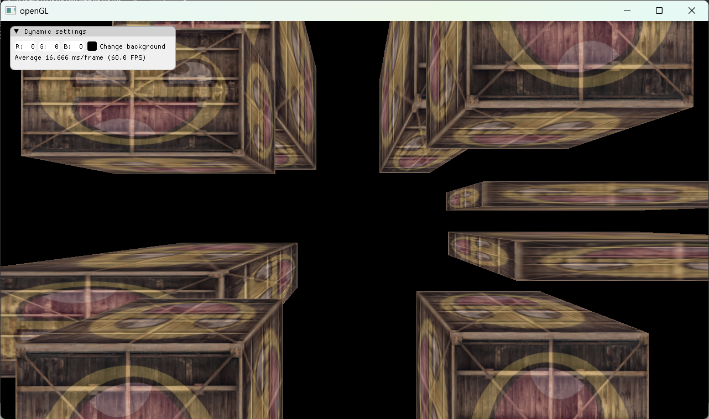
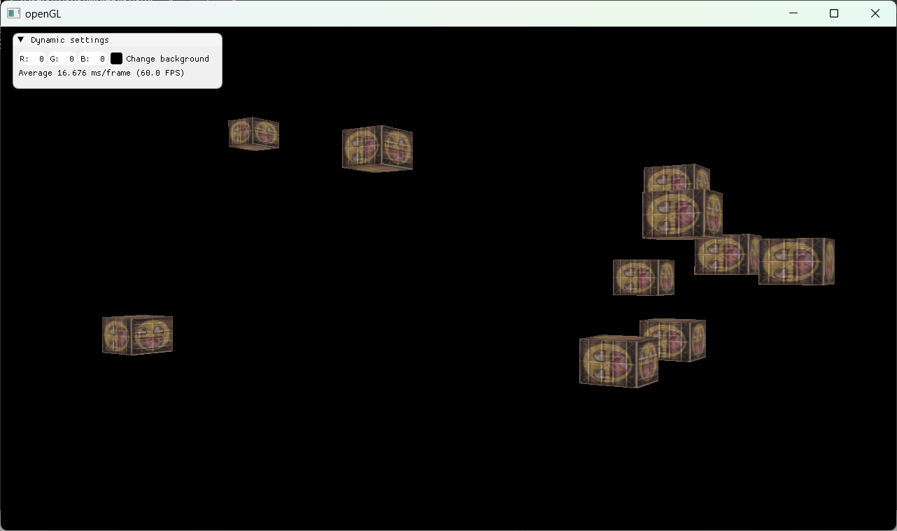
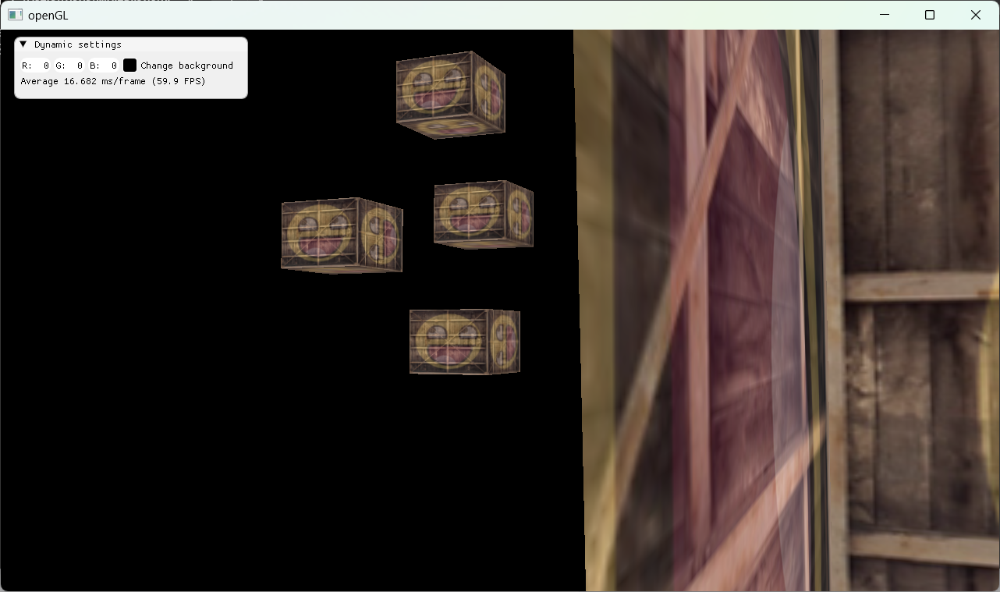

## openGL
Learning openGL by following the [learnopengl](https://learnopengl.com/) site. 

## Roadmap
### Getting started 
- [x] openGL
- [x] Creating a window
- [x] Hello world
- [x] Hello triangle
- [x] Shaders
- [x] Textures
- [x] Transformations
- [x] Coordinate Systems
- [x] Camera

### Lightning
- [ ] Colors
- [ ] Basic Lighting
- [ ] Materials
- [ ] Lighting maps
- [ ] Light casters
- [ ] Multiple lights

## Screenshots

## Libraries
- [glfw](https://github.com/glfw/glfw)
- [glad](https://github.com/Dav1dde/glad)
- [Dear ImGui](https://github.com/ocornut/imgui)
- [stb](https://github.com/nothings/stb)

